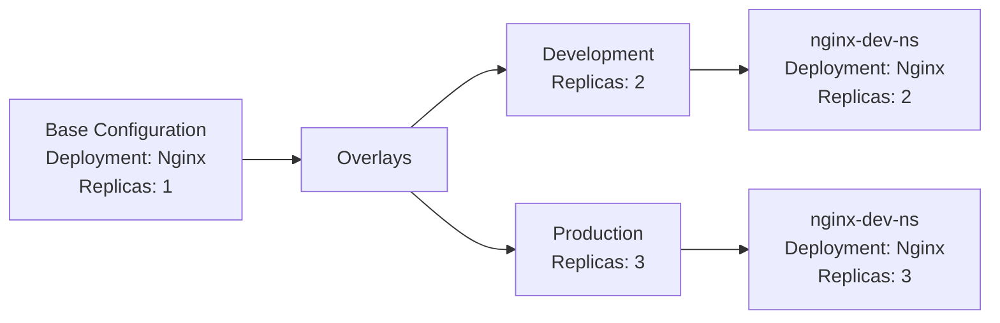

# Kustomize Tutorial

## Overview
This tutorial is based on the [Kustomize Tutorial](https://devoriales.com/post/266).

```mermaid
flowchart LR

  Base["Base Configuration <br/> Deployment: Nginx <br/> Replicas: 1"]

  Overlays["Overlays"]
  Dev["Development <br/> Replicas: 2"]
  Prod["Production <br/> Replicas: 3"]

  FinalDev["nginx-dev-ns <br/> Deployment: Nginx <br/> Replicas: 2"]
  FinalProd["nginx-dev-ns <br/> Deployment: Nginx <br/> Replicas: 3"]

  Base --> Overlays
  Overlays --> Dev
  Overlays --> Prod
  Dev --> FinalDev
  Prod --> FinalProd
```
