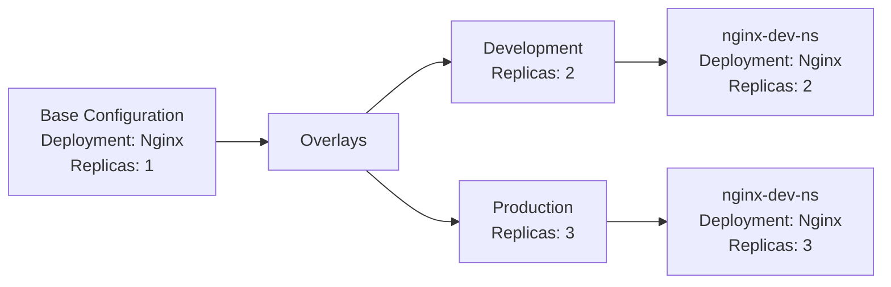

# Kustomize Tutorial

devoriales.com

## Overview
This tutorial is based on the [Kustomize Tutorial](https://devoriales.com/post/266).

## Diagram

The following diagram shows the flow of the tutorial:

We will start with a base configuration and then create two overlays, one for development and one for production. The development overlay will have two replicas and the production overlay will have three replicas. The final result will be two deployments, one for development and one for production.
